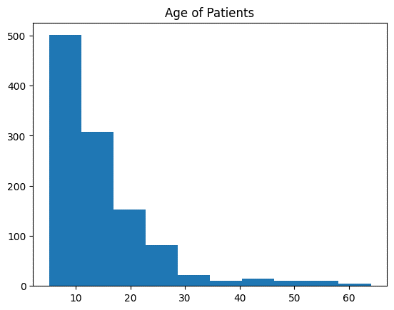
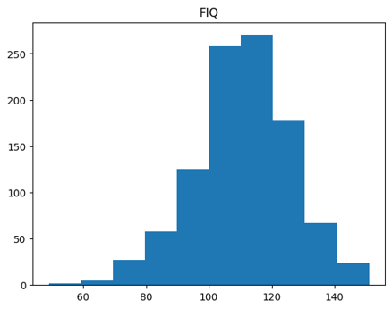
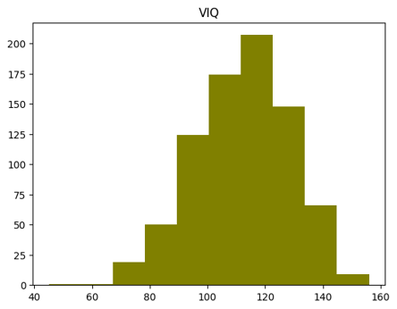
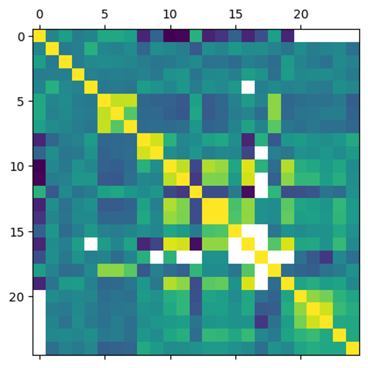
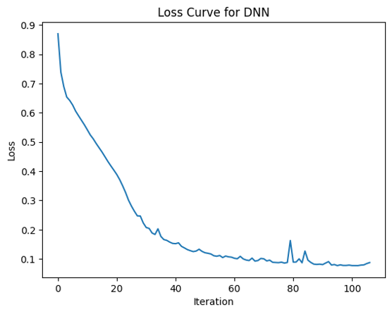
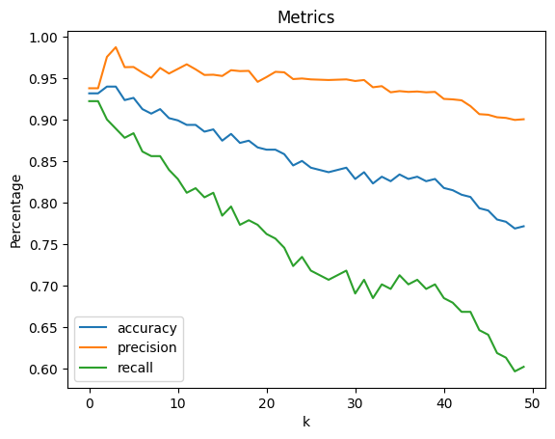

Jason Bard 
DATA 3421-001 
28 April 2023 

# Introduction 

Autism spectrum disorder (ASD) can be characterized by impairment of social ability and by repetitive interests and/or behaviors. As of 2022, about 1 in 36 children have been identified as having the disorder. In this project, a phenotypic dataset of tested individuals was used to train three separate machine learning algorithms: DNN, k-NN, and Decision Tree. These models were then tested in order to produce a binary classification result of whether or not an individual patient has ASD.

# Dataset

The Autism Brain Imaging Data Exchange (ABIDE) is a collection of brain scans of more than 1000 individuals, about half of whom have been diagnosed with ASD. This dataset contains both phenotypic data of individual patients as well as functional MRIs collected at resting state (rs-fMRIs), which reflects changes in blood flow and brain activity of individual patients. The phenotypic data is readily available at https://www.nitrc.org/frs/downloadlink.php/9108. It contains 1114 individuals with 348 features.

# Exploratory Data Analysis

There are several graphs derived from exploring the data, such as a histogram of the ages of the patients, a category count of their handedness, and histograms of the three types of IQ tests.

  

The correlation matrix of all categories after preprocessing is also useful to look at.

# Data Preprocessing

The phenotypic data contained the sums of scores for various questionnaires and therapeutic tests that the patients underwent. Additionally, the data had scores for each category of every test, including three types of IQ tests. No patient underwent every test; in fact, many patients only underwent one or two of these tests. In response to this, NaNs were present wherever a test was not performed on a patient. To indicate that a patient did not do a test, all the scores were replaced with -1, since they are non-negative integers. Moreover, the IQ tests were encoded using one-hot encoding in discerning which type was administered. However, the data was not normalized because it was suspected this may introduce unnecessary bias into the machine learning models. Finally, one subject was disqualified because their eye status at scan was undetermined. In the end, the dataset became 1113 inputs with 74 features.

# Model Selection

1. A DNN was selected with layers (75, 100, 50, 25, 15, 5) and stochastic gradient descent as the solver. ReLU was chosen as the activation with the cross-validation fraction at 0.1.
2. A *k*-NN algorithm was selected, where the *k* that yielded the highest accuracy was selected.
3. A decision tree algorithm was selected.

Each of these models were loaded in scikit-learn, and then were trained using a randomized training set comprising 80% of the original data. The remaining 20% was used as testing data, and was used to gauge the accuracy, precision, and recall of each model.

# Results

The graph on the left shows the loss curve over time while the DNN was being trained. The graph on the right shows the accuracy, precision, and recall for each *k* in the *k*-NN that was trained on the dataset.

 

The table below illustrates the overall results:

  
| Model            | Accuracy | Precision | Recall   |
|------------------|----------|-----------|----------|
| DNN              | 0.961957 | 0.982659  | 0.939227 |
| *k*-NN (*k* = 3) | 0.940217 | 0.976048  | 0.900552 |
| Decision Tree    | 0.956522 | 0.945946  | 0.966851 |
  

# Conclusion

This project shows that utilization of a DNN was best for this dataset, although there may have been some information loss given that the sums of each test score were used and not the score of each activity of each test. Additionally, the data was not normalized, so normalizing it and potentially performing PCA in future runs may help increase accuracy.
